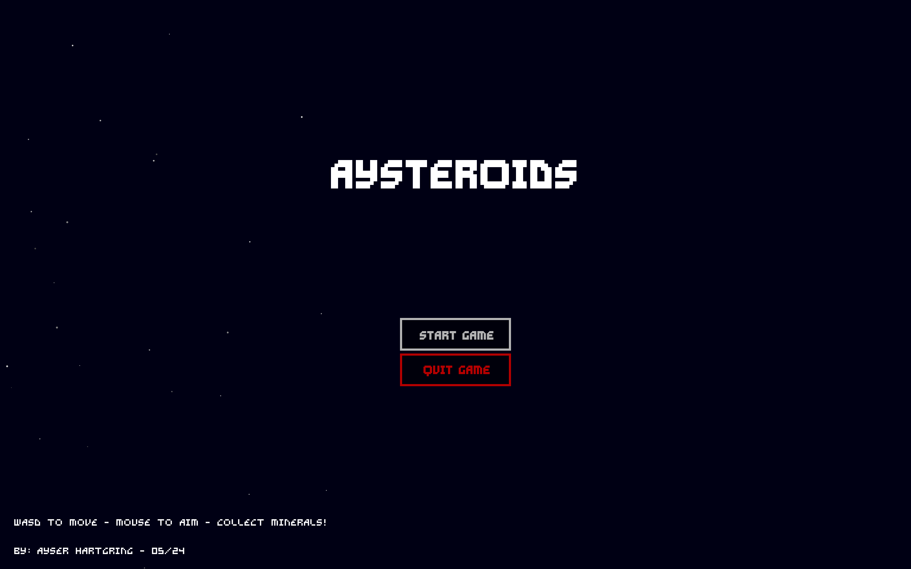

# Aysteroids

## Description
An asteroids-like game made in C++ and SFML for the BUas CMGT intake procedure (numerus-fixus).<br>
**Result**: Accepted!




## What I Learned
This is my first videogame written in C++. I learned many things in a short time:
- Manually handling dependencies (static and dynamic) through project configurations
- A simple game loop (when to update input, update objects, render objects, etc)
- A design pattern called "object pool" to reuse already allocated objects
- Collision detection and resolution
- Pointers and references
- What the difference is between a list and vector and when to use them

In order to do this, I used a few resources:
- [Beginning C++ Through Game Programming, 4th ed](https://books.google.nl/books/about/Beginning_C++_Through_Game_Programming_4.html?id=pd0OBAAAQBAJ&redir_esc=y#:~:text=In%20the%20new%20fourth%20edition%20of%20this%20popular,of%20the%20book%20draws%20together%20everything%20you%E2%80%99ve%20learned.)
- [C++ Fast Track for Games Programming](https://www.3dgep.com/cpp-fast-track-1-getting-started/) (the full series)
- [SFML 2.4 For Beginners](https://www.youtube.com/watch?v=axIgxBQVBg0&list=PL21OsoBLPpMOO6zyVlxZ4S4hwkY_SLRW9) (the full series)

## Features
- 2D elastic collisions based on [this article](https://www.vobarian.com/collisions/2dcollisions2.pdf)
- Fixed 2560x1600px resolution, because I did not have time for dynamic scaling

## Installation and Setup
The project uses **vcpkg manifests** to install dependencies and include source code. Therefore to build the project, [vcpkg](https://github.com/microsoft/vcpkg) is required.<br><br>
In the root folder of the project (next to vcpkg.json):
```bash
vcpkg install --triplet x86-windows
```

## Controls
| Action    | Key     | Description                                      |
|-----------|---------|--------------------------------------------------|
| Fly Right | D       | Ship flies right                                 |
| Fly Up    | W       | Ship flies up                                    |
| Fly Left  | A       | Ship flies left                                  |
| Fly Down  | S       | Ship flies down                                  |
| Fire      | Left MB | Ship fires projectile at the facing direction    |
| Aim       | Cursor  | Ship faces the cursor                            |

## Dependencies
The project depends on [SFML](https://github.com/SFML/SFML), a Simple and Fast Multimedia Library. This includes:
- Audio and sound effects
- Inputs
- Windows
- Graphics

## Patches
I wanted to keep the repository as vanilla as possible, but there were some major bugs/disturbances that had to be fixed:
- Added vcpkg manifests to not bloat the repository with dependencies
- Added an asset folder (for the fonts) to remove the build folders
- Fixed the game on 2560x1600px resolution
- Fixed the game starting in game over state
- Fixed the player speed-up at the first run
- Changed folder names and moved source files
